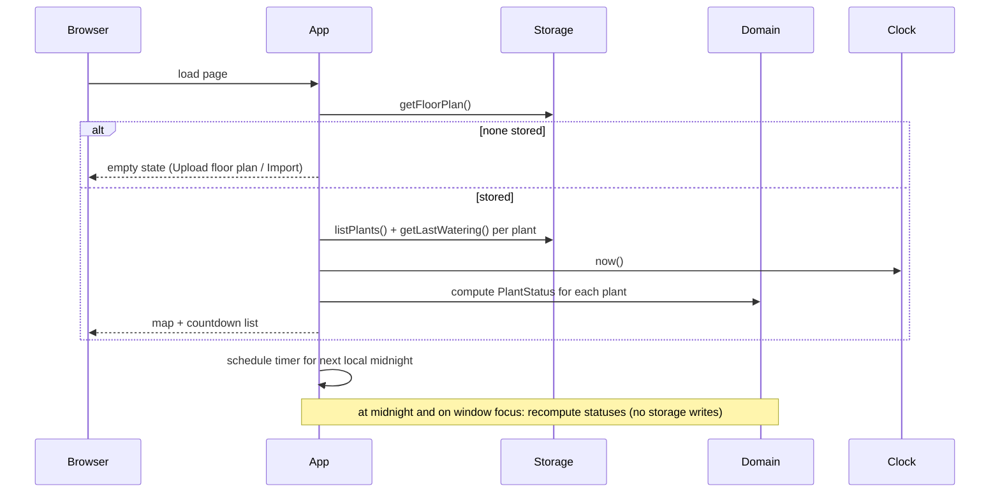
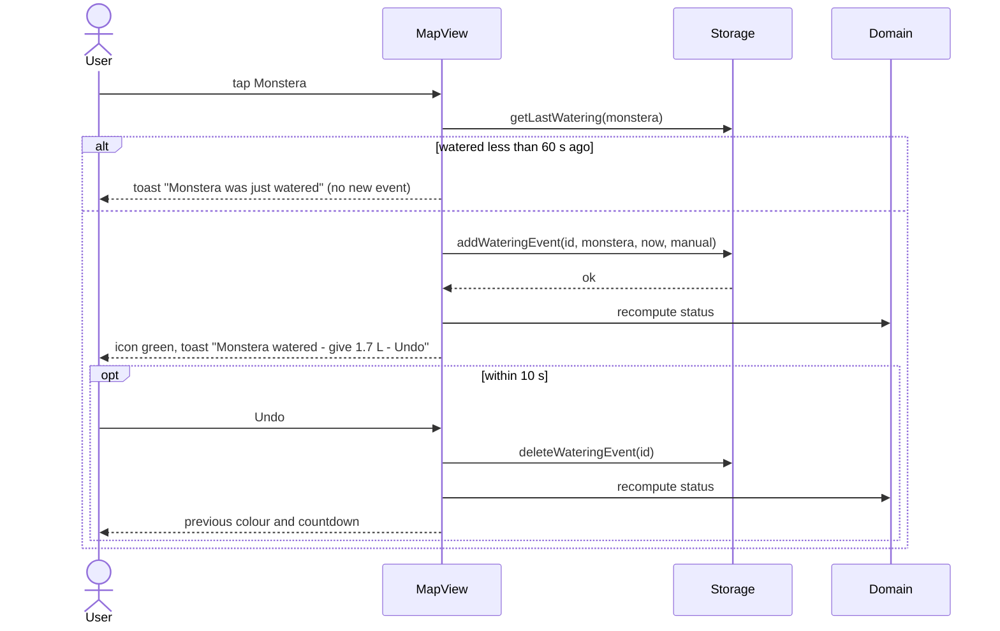
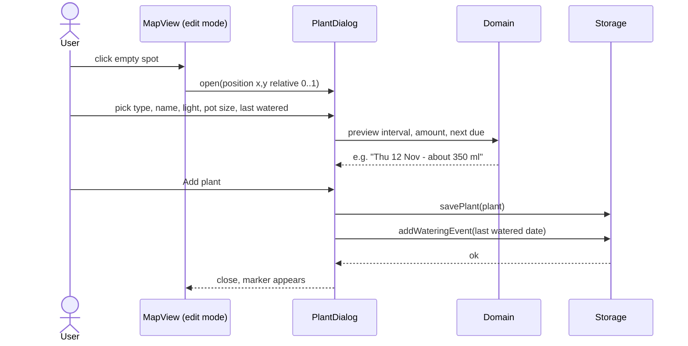
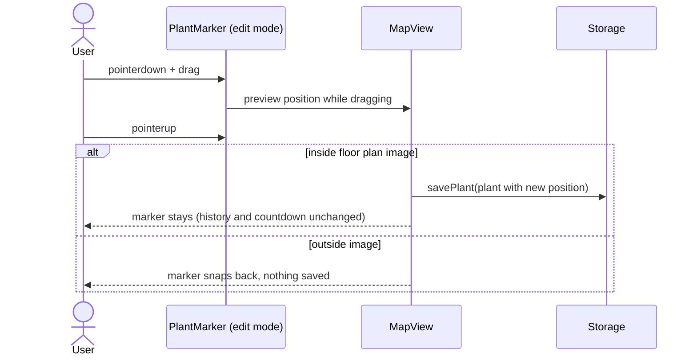
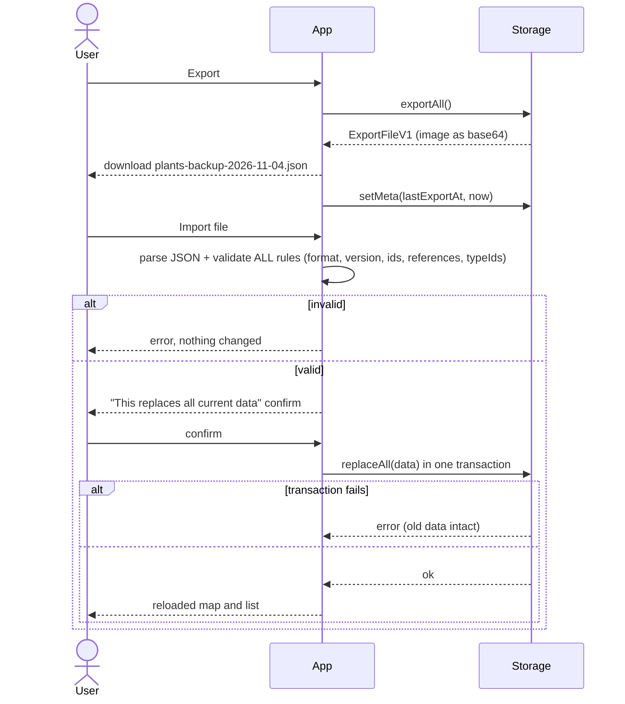

# 07 - Key sequences

## Startup and midnight refresh

```mermaid
sequenceDiagram
  participant B as Browser
  participant A as App
  participant S as Storage
  participant D as Domain
  participant C as Clock
  B->>A: load page
  A->>S: getFloorPlan()
  alt none stored
    A-->>B: empty state (Upload floor plan / Import)
  else stored
    A->>S: listPlants() + getLastWatering() per plant
    A->>C: now()
    A->>D: compute PlantStatus for each plant
    A-->>B: map + countdown list
  end
  A->>A: schedule timer for next local midnight
  Note over A,D: at midnight and on window focus: recompute statuses (no storage writes)
```

## Tap to water, double tap, undo

```mermaid
sequenceDiagram
  actor U as User
  participant M as MapView
  participant S as Storage
  participant D as Domain
  U->>M: tap Monstera
  M->>S: getLastWatering(monstera)
  alt watered less than 60 s ago
    M-->>U: toast "Monstera was just watered" (no new event)
  else
    M->>S: addWateringEvent(id, monstera, now, manual)
    S-->>M: ok
    M->>D: recompute status
    M-->>U: icon green, toast "Monstera watered - give 1.7 L - Undo"
    opt within 10 s
      U->>M: Undo
      M->>S: deleteWateringEvent(id)
      M->>D: recompute status
      M-->>U: previous colour and countdown
    end
  end
```

## Add a plant

```mermaid
sequenceDiagram
  actor U as User
  participant MV as MapView (edit mode)
  participant DL as PlantDialog
  participant D as Domain
  participant S as Storage
  U->>MV: click empty spot
  MV->>DL: open(position x,y relative 0..1)
  U->>DL: pick type, name, light, pot size, last watered
  DL->>D: preview interval, amount, next due
  D-->>DL: e.g. "Thu 12 Nov - about 350 ml"
  U->>DL: Add plant
  DL->>S: savePlant(plant)
  DL->>S: addWateringEvent(last watered date)
  S-->>DL: ok
  DL-->>MV: close, marker appears
```

## Move a plant (balcony to living room in winter)

```mermaid
sequenceDiagram
  actor U as User
  participant MK as PlantMarker (edit mode)
  participant MV as MapView
  participant S as Storage
  U->>MK: pointerdown + drag
  MK->>MV: preview position while dragging
  U->>MK: pointerup
  alt inside floor plan image
    MV->>S: savePlant(plant with new position)
    MV-->>U: marker stays (history and countdown unchanged)
  else outside image
    MV-->>U: marker snaps back, nothing saved
  end
```

## Export and import

```mermaid
sequenceDiagram
  actor U as User
  participant A as App
  participant S as Storage
  U->>A: Export
  A->>S: exportAll()
  S-->>A: ExportFileV1 (image as base64)
  A-->>U: download plants-backup-2026-11-04.json
  A->>S: setMeta(lastExportAt, now)

  U->>A: Import file
  A->>A: parse JSON + validate ALL rules (format, version, ids, references, typeIds)
  alt invalid
    A-->>U: error, nothing changed
  else valid
    A-->>U: "This replaces all current data" confirm
    U->>A: confirm
    A->>S: replaceAll(data) in one transaction
    alt transaction fails
      S-->>A: error (old data intact)
    else
      S-->>A: ok
      A-->>U: reloaded map and list
    end
  end
```
